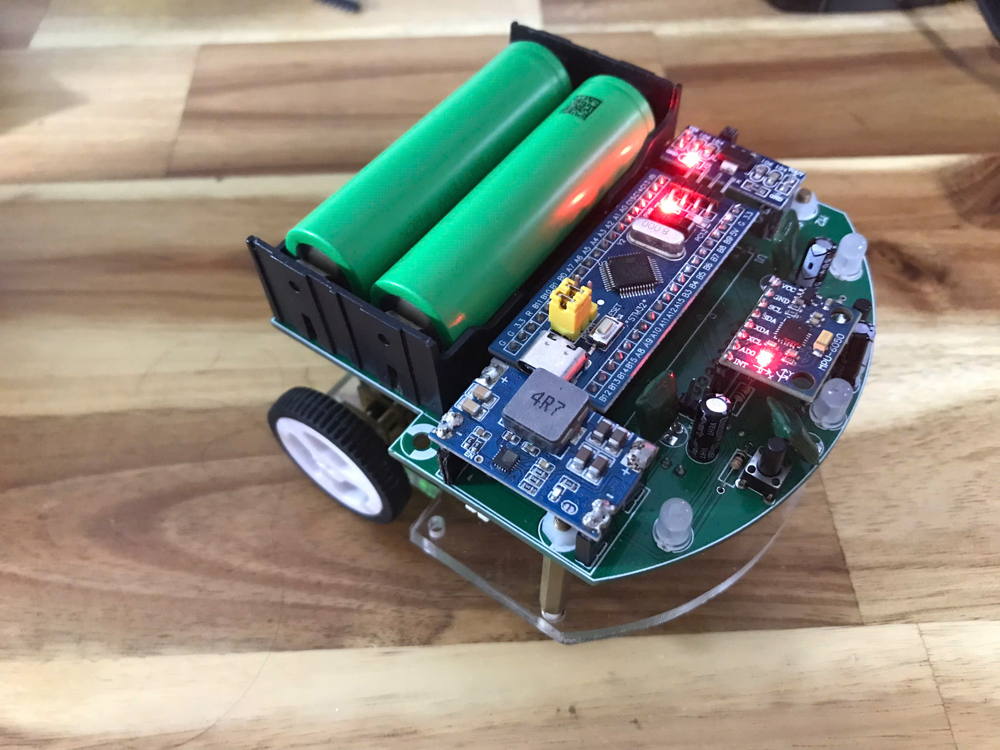

# Micromouse
This is the source code and PCB layout for project micromouse. This using stm32f103C8T6 microcontroller.

## Introduction
This project is in the reseach phase and includes 4 component.
1. Hardware PCB
2. Firmware
3. Case
4. Simulate micromouse
   
Hardware: 
- MCU STM32f103c8t6
- MPU 6050
- Motor Encoder
- TB6612 driver
- Distance sensor GP2Y0A41SK0F
- Mini 560 5V
- AMS1117 - 3.3V

  

Firmware:
- Uses PID control and Compass function with the MPU6050
- Applied the Flood Fill Algorithm (DFS) to solve the maze.

Case:
- Design in SolidWorks with a base made from mica.
Simulation:
  implements Flood Fill Algorithm in C.
  
**Author** Minh Tuan

**Date:** October 12, 2024
